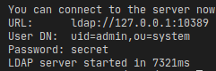
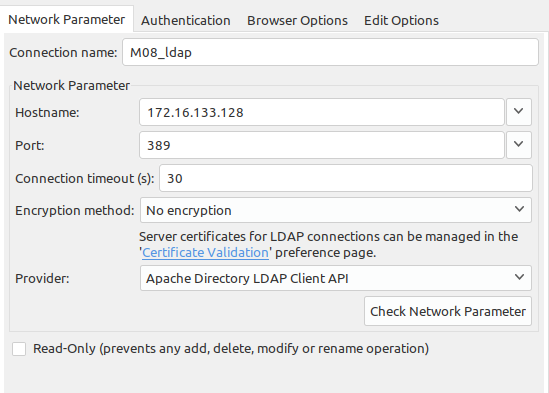
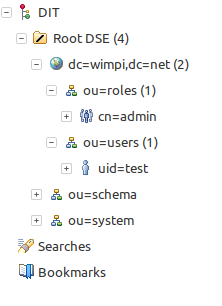
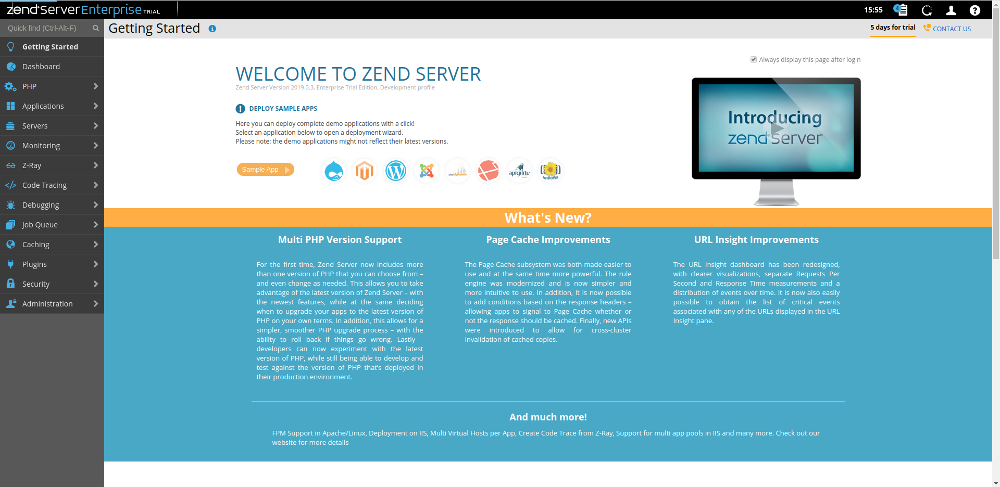
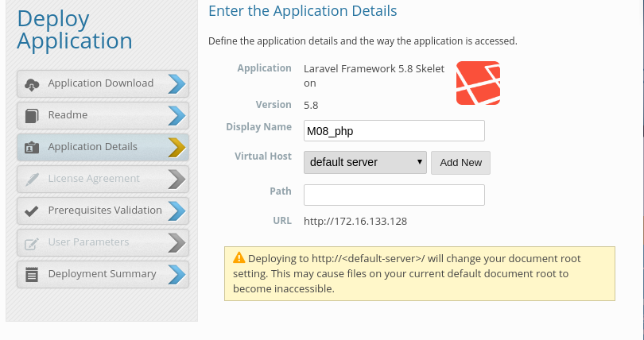
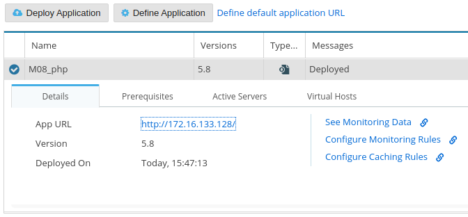
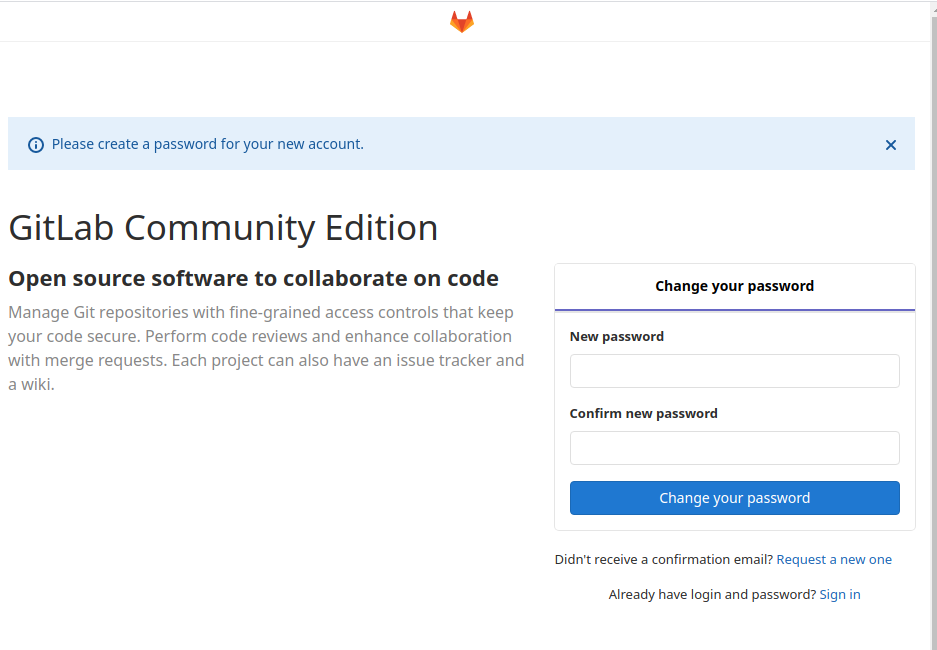
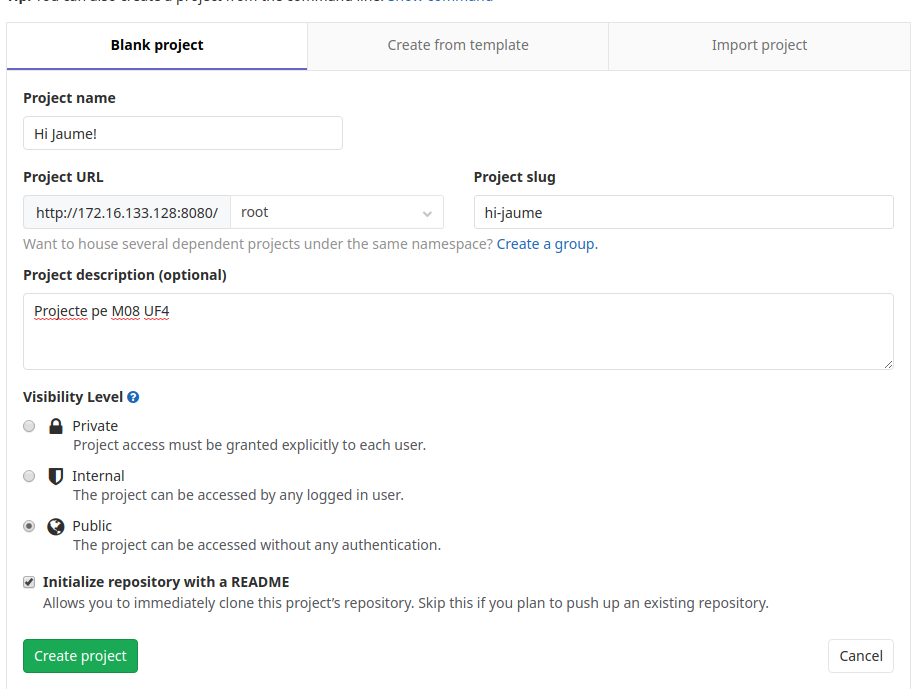
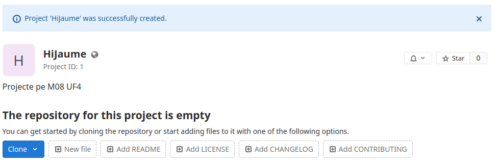

## M08 UF4 Desplegament d'Aplicacions web

# mitjana.com
Autor: Jose Luis Tresserras
## Projecte UF2, UF3 i UF4

### 1. [DNS](#1-dnsDNS-1)
### 2. [OPENLDAP](#2-openldap-1)
### 3. [Zend Server](#3-zend-server-1)
### 4. [Documentació PHP](#4-documentació-php-1)
### 5. [Desenvolupament cooperatiu](#5-desenvolupament-cooperatiu-1)
### 6. [Docker](#6-docker-1)

<br>

## 1. DNS
Per configurar el DNS, no es pot fer amb docker ja que significari crear un contenidor ubuntu per installar el Bind9, i no crec que valgui la pena... (El seguent enllaç explica com s'ha de fer --
https://medium.com/@thiago.nobayashi/running-a-dns-server-in-docker-61cc2003e899).
Aixó pasa, ja que no s'hauria de poder instal·lar dos DNS, ja que només resoltran una serie de IP's, el que s'ha de fer es que els demés servidors, agafin el DNS del servidor principal.

He creat un DNS, que apunta a la meva mitjana empresa: ```mitjana.com```

Per crear-lo he hagut d'instal·lar Bind9 i crear/editar els fitxers named.conf.local i db.mitjana:

```named.conf.local```
```sh
//
// Do any local configuration here
//

// Consider adding the 1918 zones here, if they are not used in your
// organization
//include "/etc/bind/zones.rfc1918";

zone "mitjana.com" {
	type master;
	file "/etc/bind/db.mitjana";
};
```

<br>

```db.mitjana```
```
;
; BIND data file for local loopback interface
;
$TTL	604800
@	IN	SOA	mitjana.com. root.mitjana.com. (
			      2		; Serial
			 604800		; Refresh
			  86400		; Retry
			2419200		; Expire
			 604800 )	; Negative Cache TTL
;
@	IN	NS	mitjana.com.
@	IN	A	172.16.133.129

mitjana.com.	IN	A	172.16.133.129
mitjana.com.	IN	NS	mitjana.com.
```

Un cop fet, nomes faria falta reiniciar el servei Bind9 i ja el tindriem creat!


<br>

## 2. OPENLDAP
Per crear un serveide directoris, he fet servir docker amb la imatge ```dwimberger/ldap-ad-it```, aquesta imatge es decarrega el servidor i l'executa. Per poder administrar aquest servidor, he descarregat l'Apache Directory Studio (ADS).








<br>

## 3. Zend Server
Zend server, es com un CMS, però per aplicacions PHP.



He intentat crear una aplicació amb Laravel i han sigut 4 clicks



#### Problemes
Al projecte, dona un error de permisos i no he trobat res a Google



<br>

## 4. Documentació PHP
Estudiant com implamentar la documentació de l'aplicació, he trobat una eina que funciona amb composer que l'instales i fas una comanda per generar la documentació. Normalment, no es puja tota la aplicació al servidor ja que hi han paquets que es generan un cop a cada ordinador i no cal que el servidor els tingui, ja que només farien nosa, llavors la eina de documentació s'afagiria al projecte, pero no seria necesari tindre l'eina instalada al servidor i cada cop que vulguesis generar la documentació nomes hauries de fer la comanda.

```sh
docker run --rm --interactive --tty --volume $PWD:/app composer composer require --dev theseer/phpdox 
```

```sh
vendor/bin/phpdox -f path/to/phpdox.xml
```

<br>

## 5. Desenvolupament cooperatiu
Per el desenvolupament corporatiu, he escollit GitLab, GitLab es una plataforma que permet instl·lar la seva plataforma al teu servidor. Permet crear repositoris, manegar usuaris, i mil coses mes, es una eina opensource molt completa.







### Problemes
Els minims necesaris per poder fer anar aquesta aplicació son molt alts, he hagut de donar 2 processadors amb 2 cores i 2 GB de RAM per poder entrar a la web.

<br>

## 6. Docker
Per aquest servidor, docker es imprescindible, ja que la majoria de les aplicacions instal·lades son contenidors.
Per aixecar totes les aplicacions docker, cal copiar el ```docker-compose.yml```, i els dockerfiles de l'OPENLDAP i Laminas Framework.

```yml
version: '3'
services:
    ldap:
        image: dwimberger/ldap-ad-it
        build: ./ldap
        ports: 
            - '389:10389'
    zend:
        image: php-zendserver
        ports:
            - '80:80'
            - '10088:10081'
        environment:
            - MYSQL_HOSTNAME=localhost
            - MYSQL_PORT=3306
            - MYSQL_USERNAME=jose
            - MYSQL_PASSWORD=passwd
            - MYSQL_DBNAME=zend
    git:
        image: gitlab/gitlab-ce:latest
        ports:
            - '8080:80'
        volumes:
            - /var/lib/docker/mitjana/gitlab/config:/etc/gitlab
            - /var/lib/docker/mitjana/gitlab/logs:/var/log/gitlab
            - /var/lib/docker/mitjana/gitlab/data:/var/opt/gitlab
```

<br>
